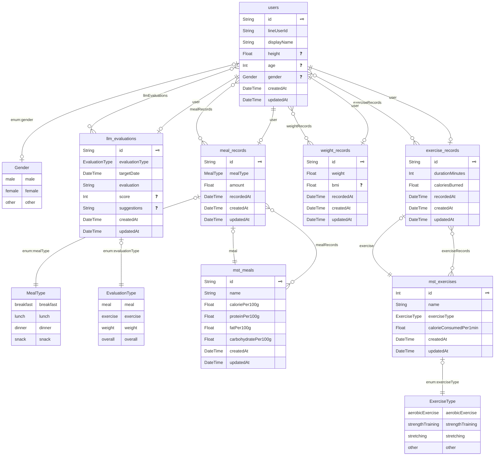

```mermaid
erDiagram

        Gender {
            male male
female female
other other
        }
    


        ExerciseType {
            aerobicExercise aerobicExercise
strengthTraining strengthTraining
stretching stretching
other other
        }
    


        MealType {
            breakfast breakfast
lunch lunch
dinner dinner
snack snack
        }
    


        EvaluationType {
            meal meal
exercise exercise
weight weight
overall overall
        }
    
  "users" {
    String id "🗝️"
    String lineUserId 
    String displayName 
    Float height "❓"
    Int age "❓"
    Gender gender "❓"
    DateTime createdAt 
    DateTime updatedAt 
    }
  

  "mst_meals" {
    String id "🗝️"
    String name 
    Float caloriePer100g 
    Float proteinPer100g 
    Float fatPer100g 
    Float carbohydratePer100g 
    DateTime createdAt 
    DateTime updatedAt 
    }
  

  "meal_records" {
    String id "🗝️"
    MealType mealType 
    Float amount 
    DateTime recordedAt 
    DateTime createdAt 
    DateTime updatedAt 
    }
  

  "mst_exercises" {
    Int id "🗝️"
    String name 
    ExerciseType exerciseType 
    Float calorieConsumedPer1min 
    DateTime createdAt 
    DateTime updatedAt 
    }
  

  "exercise_records" {
    String id "🗝️"
    Int durationMinutes 
    Float caloriesBurned 
    DateTime recordedAt 
    DateTime createdAt 
    DateTime updatedAt 
    }
  

  "weight_records" {
    String id "🗝️"
    Float weight 
    Float bmi "❓"
    DateTime recordedAt 
    DateTime createdAt 
    DateTime updatedAt 
    }
  

  "llm_evaluations" {
    String id "🗝️"
    EvaluationType evaluationType 
    DateTime targetDate 
    String evaluation 
    Int score "❓"
    String suggestions "❓"
    DateTime createdAt 
    DateTime updatedAt 
    }
  
    "users" o|--|o "Gender" : "enum:gender"
    "users" o{--}o "weight_records" : "weightRecords"
    "users" o{--}o "meal_records" : "mealRecords"
    "users" o{--}o "exercise_records" : "exerciseRecords"
    "users" o{--}o "llm_evaluations" : "llmEvaluations"
    "mst_meals" o{--}o "meal_records" : "mealRecords"
    "meal_records" o|--|| "MealType" : "enum:mealType"
    "meal_records" o|--|| "users" : "user"
    "meal_records" o|--|| "mst_meals" : "meal"
    "mst_exercises" o|--|| "ExerciseType" : "enum:exerciseType"
    "mst_exercises" o{--}o "exercise_records" : "exerciseRecords"
    "exercise_records" o|--|| "users" : "user"
    "exercise_records" o|--|| "mst_exercises" : "exercise"
    "weight_records" o|--|| "users" : "user"
    "llm_evaluations" o|--|| "EvaluationType" : "enum:evaluationType"
    "llm_evaluations" o|--|| "users" : "user"
```
